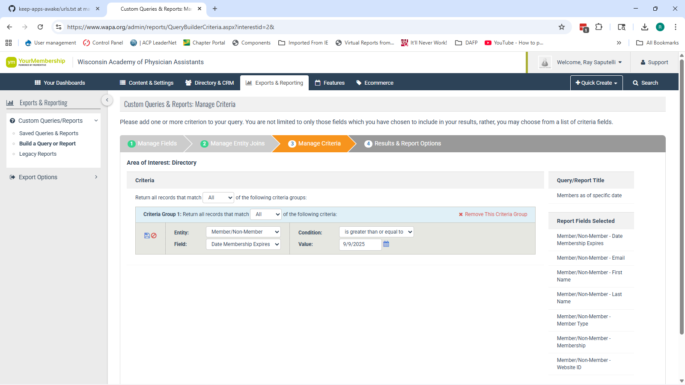
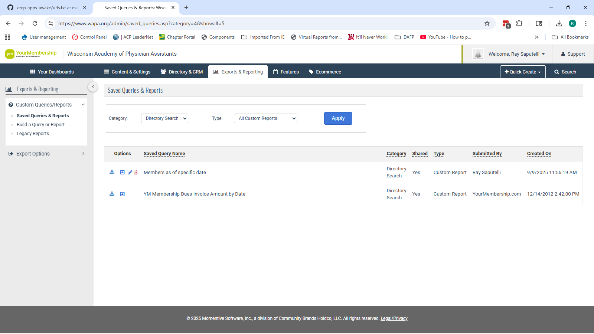

# WAPA – Member Type Summary & Trends
_User Guide & Instructions_

## Part 1. Generating the Member Report from YourMembership (YM)

Before using the app, you need to export the raw membership data from YourMembership.

### IMPORTANT:  You should try to run this as close to the first of the month as possible.

### Steps
1. **Navigate to Exports & Reporting**  
   In the YM admin dashboard, go to **Exports & Reporting**.  
   

2. **Click "Saved Queries and Reports" in the left menu**  
   This opens your list of saved report templates.

3. **Set filters**  
   - **Category:** `Directory Search`  
   - **Type:** `All Custom Reports`  
   

4. **Load the query**  
   - Find **“Members as of specific date”**  
   - Click the blue **Load Query** icon (to the left of the pencil).

5. **Update the criteria**  
   - When the query opens, click the **pencil (edit)**.  
   - Change the **Date Membership Expires** value to **today’s date**.  
   - Click the **save** icon.

6. **Run the report**  
   - After saving, click **Run Report**.  
   - A CSV file will be generated and downloaded. This file contains all required columns (including `Member Type` and `Membership`).

---

## Part 2. Using the WAPA Member Summary & Trends App

The Streamlit app has two main functions:

### 1) Create a Monthly Summary from Raw Export
- Go to the **first tab** in the app: _“Create Monthly Summary from Raw Export”_.  
- Upload the CSV you just downloaded from YM.  
- The app will:
  - Display a preview of the data.  
  - Generate:
    - **Member Type Totals** (overall counts by Member Type).  
    - **Membership Breakdown** (sub-groups within each Member Type).  
  - Render two charts:
    - Total Members by Member Type.  
    - Membership Breakdown (stacked chart with legend totals).  
- Download buttons are available for:
  - Both charts (as PNG images).  
  - The summary Excel file (`Member_Type_Summary_YYYY-MM-DD.xlsx`) containing both tables.
### IMPORTANT – You MUST SAVE the output file in Dropbox so that you have it later.  If you try to recreate the report at a later date and people have renewed, the data will be skewed.

### 2) Build a Master Workbook from Multiple Summaries
- Go to the **second tab**: _“Build Master Workbook from Summaries”_.  
- Upload two or more summary Excel files (one per month).  
  - Tip: name them like `Member_Type_Summary_2025-09.xlsx` so the month is auto-detected.  
- The app will:
  - Aggregate the monthly files into a time-series table (rows = Member Types, columns = months).  
  - Compute Month-over-Month (Δ) and Percent Change (%Δ).  
  - Generate a **Trend Charts** sheet in Excel with line charts for each Member Type.  
- Download the **Master Workbook** to track trends over time.  
- The app also shows a **quick preview chart** for the top 5 Member Types (based on the latest month).

---

## Notes
- Only two fields are required in the YM export:  
  - `Member/Non-Member - Member Type`  
  - `Member/Non-Member - Membership`  
  Extra columns are ignored, so it’s fine to run a full report.  
- The app automatically inserts today’s **Run Date** into charts and filenames.  
- Logo (`logo.png`) will appear in the app header if placed in the repo root.  
